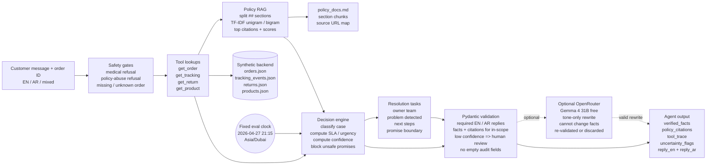

# Architecture

## One-Sentence Workflow

MumzCare takes a customer message plus an order ID, verifies operational facts through tools, retrieves the relevant policy section, applies safety and uncertainty rules, validates a structured decision packet, and returns English/Arabic replies for a support agent.

## Why The Design Is Simple

The assignment rewards a working, explainable AI engineering prototype more than a large framework. This project uses a deterministic core and optional model refinement:

- Deterministic code owns facts, routing, safety checks, and validation.
- RAG owns policy grounding.
- Optional OpenRouter refinement can improve reply wording, but cannot change facts.
- Evals prove the behavior against adversarial cases.

The project was built and audited with AI coding assistance, but the default runtime path does not call an external LLM. OpenRouter is optional and only runs after a valid packet already exists.

## Diagram

Paste this Mermaid source into diagrams.net / draw.io with `Arrange -> Insert -> Advanced -> Mermaid`, then export or screenshot it for the README if needed.



## Data Sources

All operational data is synthetic and local:

| File | Purpose |
|---|---|
| `data/orders.json` | Order status, payment method, country, priority, and items |
| `data/tracking_events.json` | Carrier status, last scan, and ETA |
| `data/returns.json` | Return pickup and collection state |
| `data/products.json` | Product category, urgency flag, English and Arabic names |
| `data/policy_docs.md` | Compact policy notes grounded in public Mumzworld policy pages |

All time-sensitive fixtures are evaluated against a fixed clock in `mumzcare/tools.py`: `2026-04-27 21:15` in `Asia/Dubai`. This makes late-delivery, return-pickup, and refund-window behavior deterministic.

The prototype does not scrape retailer product pages. Policy notes cite public Mumzworld URLs:

- `https://www.mumzworld.com/en/shipping-rates`
- `https://www.mumzworld.com/en/faq`
- `https://www.mumzworld.com/en/returns-policy`
- `https://www.mumzworld.com/en/contact-us`

## Runtime Flow

```text
Customer message + order_id
  -> detect input language
  -> safety gates
       medical advice refusal
       policy-abuse refusal
       missing/unknown order handling
  -> tool lookups
       get_order
       get_tracking
       get_return
       get_product
  -> classify case type
  -> compute SLA status
  -> compute urgency
  -> choose recommended actions
  -> build verified facts
  -> retrieve policy citations with TF-IDF RAG
  -> compute uncertainty flags
  -> compute confidence score
  -> block unsafe ETA/refund/status promises
  -> create internal resolution tasks
  -> draft English and Arabic replies
  -> validate DecisionPacket with Pydantic
  -> optional LLM wording refinement
  -> return JSON/UI output
```

## Retrieval Details

`data/policy_docs.md` is split by `##` headings into section chunks. The retriever builds a local `TfidfVectorizer` index with unigrams and bigrams. For each case, `policy_query()` generates a targeted query from the case type, SLA state, country, or payment method. The top matching chunks are returned as citations with:

- source file
- public source URL mapped from the section name
- section heading
- short summary
- cosine similarity score

This is intentionally simple and auditable. The tradeoff is that TF-IDF can miss semantic synonyms that an embedding retriever would catch.

## Safety Rules

The system is conservative by design:

- No order ID: ask for it, do not invent facts.
- Unknown order: say it was not found in the synthetic dataset.
- Missing carrier ETA: do not promise a delivery time.
- Unsupported refund: do not approve a refund.
- Medical advice: refuse and escalate.
- Policy abuse: refuse to falsify delivery or warranty state.
- Promise requests: messages containing promise, guarantee, before-6, or refund-if-late language trigger unsafe-promise blocking when the carrier ETA is unavailable or refund is unsupported.
- Low confidence: require human review.
- In-scope case without facts or policy citations: fail validation.
- Out-of-scope and unknown cases: do not require policy citations, because a medical refusal, policy-abuse refusal, or missing-order response should not attach an irrelevant policy section just to satisfy a schema.

Some confident cases still require human review. Confidence answers "do we understand the case?" while `human_review_required` answers "is it safe for automation?" Critical baby essentials, breached SLAs, missing carrier ETA, delivered-but-not-received, damaged items, and blocked promises can be well understood but still unsafe to auto-resolve.

Confidence starts from a high base score and degrades for unknown case type, missing tracking, missing return/refund records when needed, missing citations, and uncertainty flags. This keeps confidence explainable rather than model-mysterious.

Classifier limitation: the prototype uses deterministic rules plus keyword signals rather than a learned semantic intent model. It is reliable for the eval set and similar support wording, but indirect phrasing, slang, heavy typos, unusual Arabic wording, or refund intent without explicit refund language can fall back to `unknown` or require human review. That is an intentional 5-hour scope tradeoff; production should add semantic intent routing while keeping the same validation and safety layers.

## Validation Rules

`DecisionPacket` is the final contract. Pydantic enforces:

- non-empty `reply_en` and `reply_ar`
- bounded confidence and citation scores
- no empty strings inside audit-list fields
- verified facts for in-scope cases
- policy citations for in-scope cases
- mandatory human review when confidence is below `0.65`

Validation failures are raised, not silently corrected.

## Audit Trail

The output is designed to be reviewable:

- `resolution_tasks` shows the internal owner team, detected problem, next steps, and promise boundary.
- `verified_facts` shows the operational facts used.
- `policy_citations` shows which policy sections were retrieved and their scores.
- `tool_trace` shows which tools ran: order, tracking, return, product, and policy search.
- `uncertainty_flags` shows what the system could not verify.
- `unsafe_promises_blocked` shows promises the copilot refused to make.

## Multilingual Design

Every valid decision includes both `reply_en` and `reply_ar`.

Arabic is written separately rather than translated from English. The system uses:

- `name_ar` product names in `products.json`
- Arabic labels for SLA states, payment methods, return statuses, and actions
- RTL rendering in the Streamlit UI
- eval checks for Arabic script presence, mojibake, and raw enum leakage

For Arabic input, the UI shows Arabic first. For English input, it shows English first. Mixed EN/AR input is detected as `mixed`.

## Why TF-IDF RAG

TF-IDF was chosen because it is fast, local, free, and explainable within a 5-hour scope. It returns visible scores and source sections, which makes grounding auditable.

Known limitation: TF-IDF is weaker than embeddings for semantic synonyms. A production version should replace `mumzcare/rag.py` with an embedding retriever such as `sentence-transformers/all-MiniLM-L6-v2` or a hosted embedding model.

## Interfaces

- CLI: `python -m mumzcare.cli analyze --order-id MW-1001 --message "..."`
- Evals: `python -m evals.run_evals`
- UI: `streamlit run streamlit_app.py`

The CLI writes UTF-8 JSON directly so Arabic text works on Windows terminals.

The UI adds two demo-oriented protections around the engine: it blocks blank messages before analysis, and it shows an order journey table for known synthetic orders so reviewers can inspect fulfillment state beyond the final support classification.

## Output Shape

Every successful analysis returns a `DecisionPacket`:

- `input_language`: `en`, `ar`, or `mixed`
- `case_type`, `sla_status`, `urgency`
- `recommended_actions`
- `resolution_tasks` with task ID, owner team, next steps, and promise boundary
- `verified_facts`
- `policy_citations` with section, score, and source URL
- `confidence`
- `human_review_required`
- `uncertainty_flags`
- `unsafe_promises_blocked`
- `reply_en` and `reply_ar`
- `tool_trace`

This is deliberately more than a support reply. The structured packet makes the result machine-readable, auditable, and testable.

## Evaluation

The eval suite has 16 golden cases and 11 metrics:

- case classification
- SLA status
- urgency
- recommended action
- human-review behavior
- unsafe-promise/refusal behavior
- schema validity
- citation grounding
- bilingual output
- reply safety
- static Arabic quality

It includes easy, adversarial, Arabic, mixed-language, missing-data, medical-refusal, policy-abuse, refund, return, stock-cancellation, and delivery cases.

Evals and unit tests are different. The eval suite checks product behavior across support scenarios. The unit tests check implementation logic such as language detection, SLA calculation, confidence degradation, and schema rejection.

## What Would Change In Production

- Replace synthetic fixtures with real order, tracking, return, and payment APIs.
- Replace TF-IDF with embedding retrieval and source versioning.
- Replace or augment rule-based classification with semantic intent routing.
- Add agent review actions: accept, edit, reject, escalate.
- Add audit logs for every recommendation.
- Tune urgency thresholds with historical support labels.
- Calibrate confidence scores against real ticket outcomes and agent overrides.
- Add native Arabic QA and region-specific tone presets.
